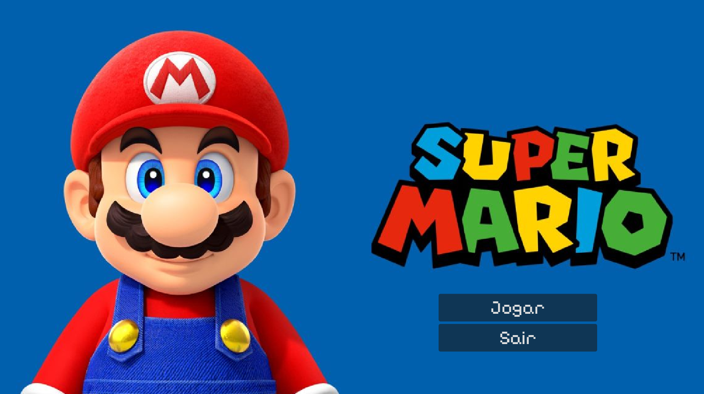
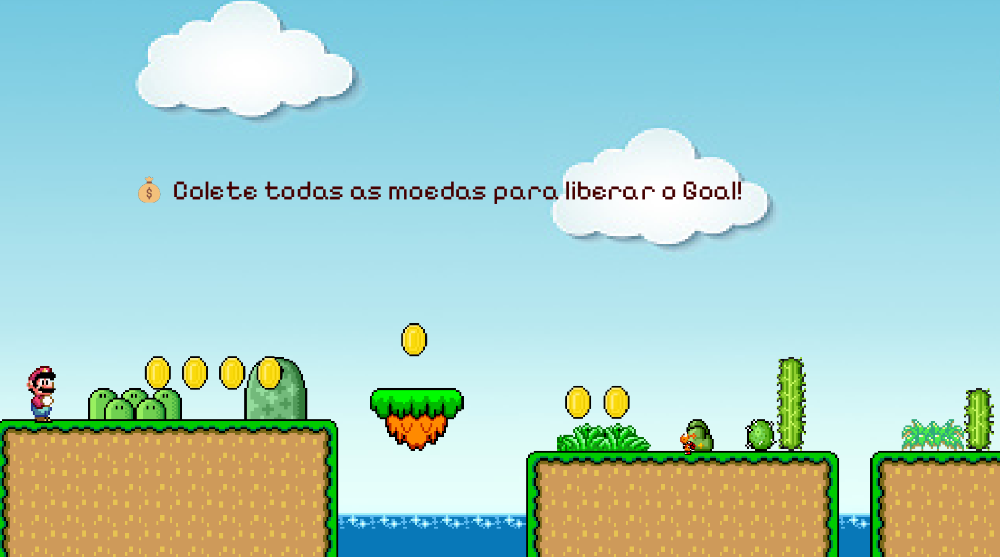
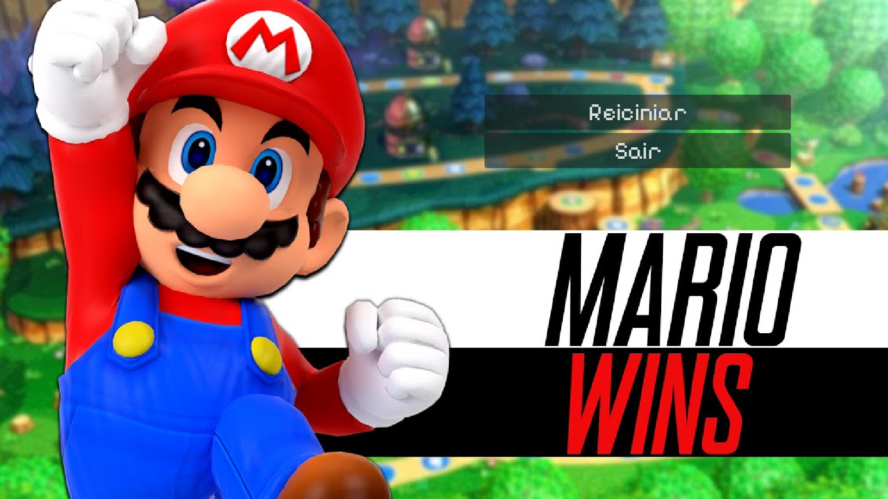
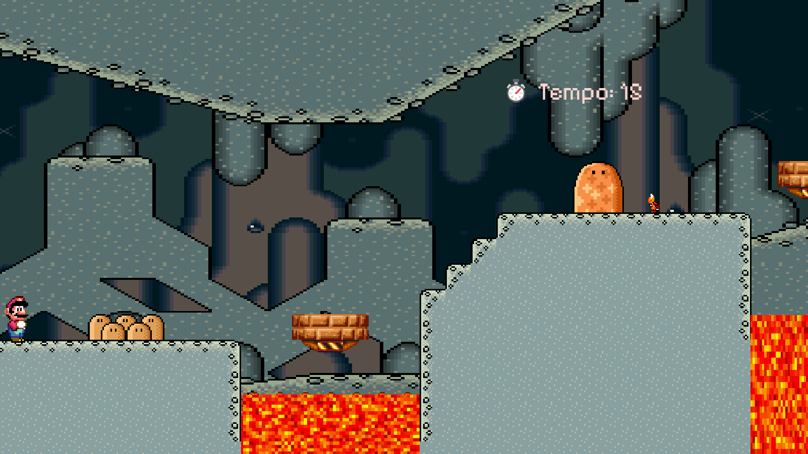
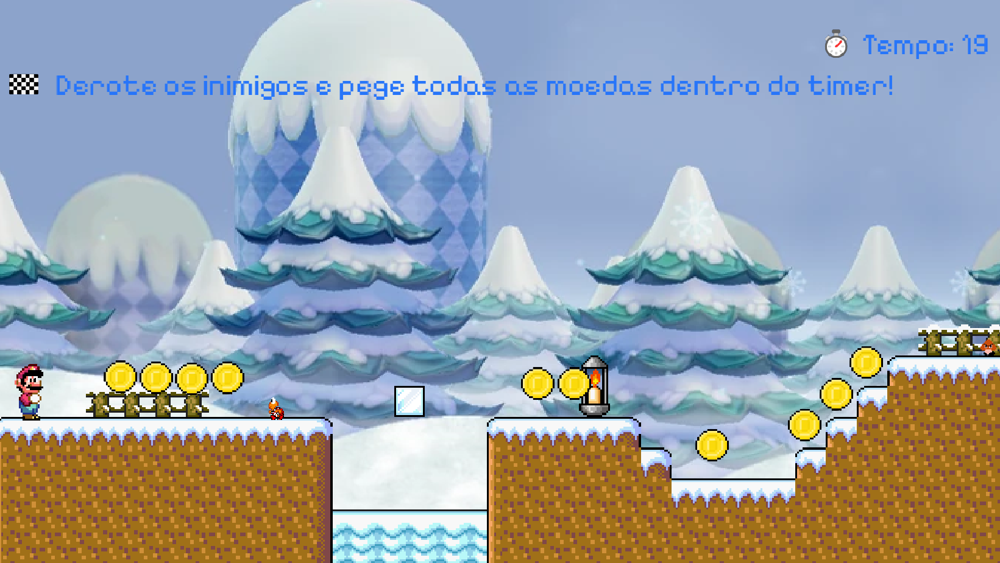
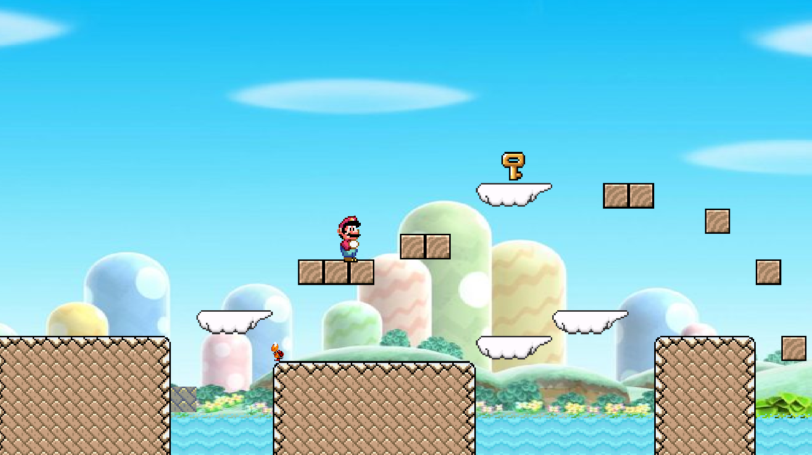

# 🍄 Super Mario - Godot Project

Um projeto de jogo de plataforma em 2D desenvolvido na **Godot Engine**, inspirado no clássico **Super Mario Bros**. O projeto explora mecânicas de movimentação, física de pulo, coleta de itens e colisão com cenários e inimigos.

---

## 📸 Capturas de Tela

| Gameplay | Fases / Elementos |
| :---: | :---: |
|  |  |
|  |  |
| |  |
| |  |


---

## 🎮 Recursos e Mecânicas

- **Controle de Personagem:** Movimentação fluida, corrida e pulo.
- **Física 2D:** Interação com blocos, plataformas e limites de mapa.
- **Inimigos & Coletáveis:** Sistema de moedas, itens e colisões.

---

## 🛠️ Tecnologias Utilizadas

- **Engine:** [Godot Engine](https://godotengine.org/) (2D)
- **Linguagem:** GDScript
- **Versionamento:** Git & GitHub

---

## 🚀 Como Rodar o Projeto Localmente

1. Faça o download e instale a **Godot Engine**.
2. Clone este repositório no seu computador:
   ```bash
   git clone [https://github.com/isabellaanton/SuperMario.git](https://github.com/isabellaanton/SuperMario.git)
